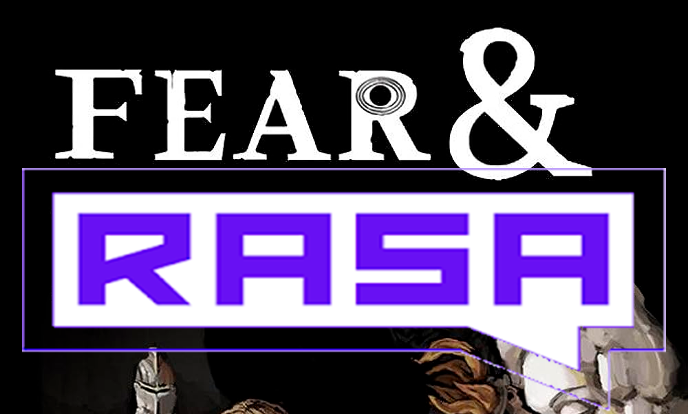

<!-- Improved compatibility of back to top link: See: https://github.com/othneildrew/Best-README-Template/pull/73 -->
<a name="readme-top"></a>
<!--
*** Fear and Hunger text game, written in the Rasa open source framework.
-->


<!-- PROJECT LOGO -->
<br />
<div align="center">
  <a href="https://github.com/1ADIS1/repository/fear-and-rasa/master/FearAndRasa.png">
    
  </a>

  <h3 align="center">Fear and Rasa</h3>

  <p align="center">
    Fear and Hunger text game, written in the Rasa open source framework.
  </p>
</div>


<!-- GETTING STARTED -->
## Getting Started

Type *play* to play the game.

### Prerequisites

This is an example of how to list things you need to use the software and how to install them.
* python 3.10.0
* python virtual environment to prevent package errors

### Installation

1. Clone repository
2. Create python 3.10.0 virtual environment
3. Activate virtual environment
4. Run *rasa train | rasa run actions --port 5055*
5. Create new terminal and run *rasa shell*
6. Type *play*


<!-- USAGE EXAMPLES -->
## Game example

```
Your input ->  play                                                                                                                                       
Choose your character: 
 Mercenary 
---------
 Mercenary, thief, assassin... Whatever brings the silver to the table. Mercenary is known for his dirty tactics in battle and crafty ways of gaining the 
advantage.

 Knight
---------
 Knight with pure and righteous ways of the warrior. Having been trained for combat since a child, knight excels in close combat and with different weaponry.

 Dark Priest
---------
 Bearing no burden on such things as morality and ethics, gives dark priest and edge in blood magic. However, devouting oneself to magic has left his physical body weak.

 Outlander
---------
 Hardened in the freezing winds of the north, outlander is an epitome of survival. He knows all the tricks to stay alive even in the most impossible of situations.
Your input ->  Dark priest
You were born with the soul of the enlightened. You are always seeking restlessly for new knowledge and secrets hidden from the common folk.
This trait started to show itself at a very young age as you were chosen to become a dark priest upon the birth of you and your twin sister.
Typical to such occult rites, you were pitted against your sibling with ritual daggers and challenged to fight each other to the very last breath.
Unfortunately for you, you were born with a fragile body and your sister easily overpowered you and had her dagger on your neck waiting for the final blow.
She however showed mercy and withdrew her dagger. She stepped away from you as your high priest masters glared gleefully at the event unfolding before their very eyes.
What will you do? (Choose 1 option)

kill - Strike your dagger to her spine while she walks away
Your input ->  defeat
You learned Mastery over insects!
You're now in front of the dungeons of Fear and Hunger... There are 2 entrances:
                Main - gigantic opened gates leading to the castle in front of you.
                Side - small wooden door to the left of the gates, nothing interesting.
Your input ->  side
In front of you there is a long staircase, leading to the darkness.
The walls are covered in thick moss, mushrooms are everywhere, and you start to feel an unpleasant smell. You can:
mushrooms - eat mushrooms from the walls
 down - go down the stairs
Your input ->  eat mushrooms
You're gatheting some mushrooms from the dry wall. They are squishy and some of them have a distinctive smell.
Despite that, you still try to taste one. As you chew it, you seem to start feeling uncomfortable tension in the belly. You puke with blood, but you cannot stop
until you fall on the ground unconsciously. It was a mistake to eat these mushrooms...
~~~~~~~
You died.
~~~~~~~
Type 'play'
```

<p align="right">(<a href="#readme-top">back to top</a>)</p>